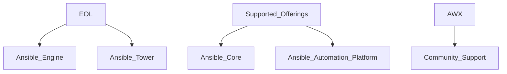
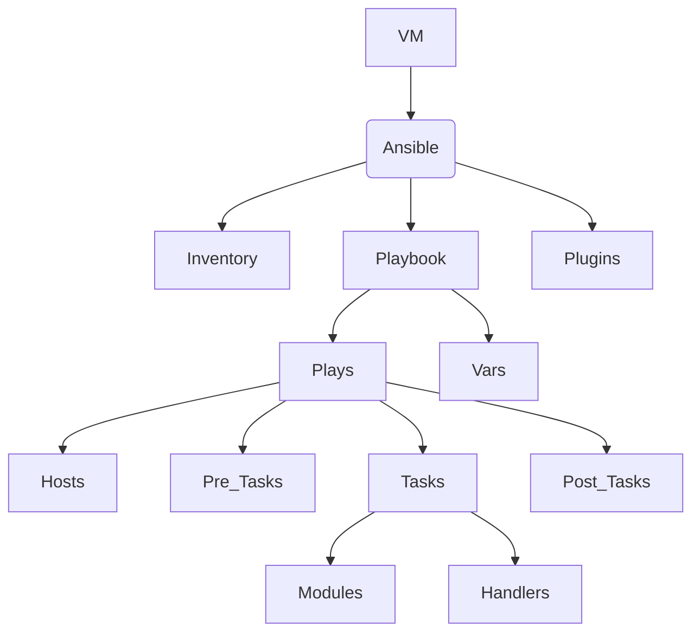
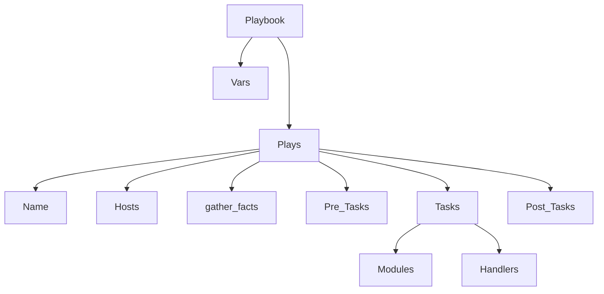
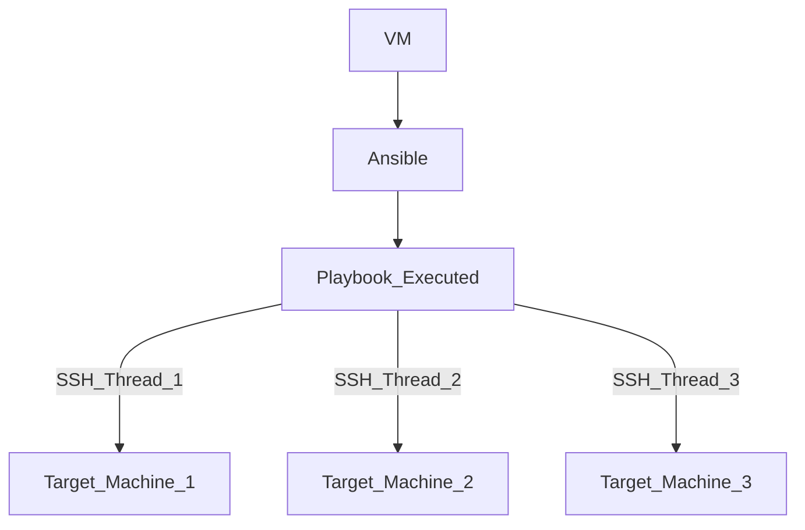

# Ansible


## What is Ansible
Ansible is defined as an open-source, cross-platform tool for resource provisioning automation that DevOps professionals popularly use for continuous delivery of software code by taking advantage of an “infrastructure as code” approach.

#### Key points
* Ansible does require Python on Linux hosts
* Ansible does require Powershell 3 on Windows hosts
* Ansible is an Open-source automation engine, written in python
* Allows for streamlining a set of configuration tasks (group tasks into playbook) 
* Allows for abstracting the underlying heterogeneous  environment – to a certain degree
* Allows you to run to run commands on multiple server
* Uses SSH to connect to devices
* It uses the YAML Syntax
* It's agentless
* Its Idempotent

## Offerings

## Common use cases
* **Provisioning environments**
    * Ansible can automate setting up and tearing down environments
    * Specify the desired structure of the environment and Ansible can Create it
* **Configuring Operating Systems**
    * Install and Remove Software
    * Ensure Services are in the desired state
		* Running
		* Stopped
    * Apply OS patches
* **Deploying applications**
    * Specify the individual tasks required to deploy an application
	* Deploy to multiple hosts / environments
    * Perform blue / green deployments
* **Performing compliance checks**
    * Create tasks for the desired state of a host / service
	* Run the tasks to enforce that state (Idempotent)
    * Report on any changes 
* **Orchestration**
    * Configurations alone do not define your environment. You need to define how multiple configurations interact, and ensure that the disparate pieces can be managed as a whole.


## How does Ansible work
Ansible connects over ssh or WinRM (windows) to a remote system to execute a task. Python 2.4+ is a requirement on the remote systems where Ansible will execute its tasks unless the remote system is a network device.

## Ansible conections
* Default connection methods:
    * SSH for linux
    * WinRM for windows
* Ansible allows per host and per group connection settings
* If all hosts share connection settings you can use the ansible.cfg


## General Architecture

# Concepts

## About Playbooks

Ansible playbooks are YAML files that define a set of instructions for Ansible to execute on specified hosts. A playbook contains one or more plays, each of which defines a set of tasks to be executed on a specific host group or individual host.

## Components of a Playbook

1. **Name**: The name of the play.
2. **Hosts**: The target hosts to run the play on. This can be a host group or an individual host defined in your inventory file.
3. **Gather Facts**: This determines whether or not to gather facts about the target host(s). By default, gather facts is set to `true`.
4. **Variables**: Variables can be defined in the playbook and passed to the play. Variables allow you to customize the execution of the play for different environments.
5. **Roles**: Roles define a set of tasks, files, and templates that can be used to execute specific actions. You can include one or more roles in your playbook.
6. **Tasks**: Tasks define the actions to be executed on the target hosts. Each task is defined using an Ansible module and its arguments.

## Example Playbook

```yaml
---
- name: Deploy Web Server
  hosts: web-server
  gather_facts: true
  roles:
    - web-server
  tasks:
  - name: Install Apache Web Server
    yum:
      name: httpd
      state: present
  - name: Start Apache Service
    service:
      name: httpd
      state: started
```


## Playbook Arquitecture

### Example

```yaml
---
- name: Configure Cisco device
  hosts: cisco
  connection: network_cli
  gather_facts: no

  tasks:
  - name: Set hostname
    cisco.ios.ios_config:
      lines:
        - hostname {{ hostname }}
      parents: ['hostname']

  - name: Set banner
    notify: task handler
    cisco.ios.ios_config:
      lines:
        - banner motd % Welcome to {{ hostname }} %
      parents: ['banner motd']
    
  - name: task handler
  ansible.builtin.debug:
    msg: I am a task handler
```

#### Ansible Playbook Execution

* By default of 5 forks, meaning it will only make maximum 5 simultaneous connections at any time, unless this parameter is changed.



## About Roles
Ansible roles provide a way for you to make it easier to reuse Ansible code generically. You can package, in a standardized directory structure, all the tasks, variables, files, templates, and other resources needed to provision infrastructure or deploy applications. Copy that role from project to project simply by copying the directory. You can then simply call that role from a play to execute it.

### Ansible role subdirectories
```
role/ 
├── defaults 
│   └── main.yml 
├── files ├── handlers 
│   └── main.yml 
├── meta 
│   └── main.yml 
├── README.md ├── tasks 
│   └── main.yml 
├── templates ├── tests │   ├── inventory 
│   └── test.yml 
└── vars 
    └── main.yml 
```

| Subdirectory | Function | 
| --- | --- |
| Defaults | The main.yml file in this directory contains the default values of role variables that can be overwritten when the role is used. These variables have low precedence and are intended to be changed and customized in plays. |
| files| This directory contains static files that are referenced by role tasks. |
| handlers| The main.yml file in this directory contains the role's handler definitions.|
| meta| The main.yml file in this directory contains information about the role, including author, license, platforms, and optional role dependencies.|
| tasks| The main.yml file in this directory contains the role's task definitions.|
| templates| This directory contains Jinja2 templates that are referenced by role tasks.|
| tests| This directory can contain an inventory and test.yml playbook that can be used to test the role.|
| vars| The main.yml file in this directory defines the role's variable values. Often these variables are used for internal purposes within the role. These variables have high precedence, and are not intended to be changed when used in a playbook.|

## About Inventory 
Ansible needs to know which servers you want to manage, because Ansible doesn't use an agent, you need to specify the servers. Ansible keeps this information in an "inventory file"

* Best practices, is to use a dynamic inventory instead of a static

### Static Inventory example
```
Mail.example.com          --\\ Host_Name

[Atlanta]                 --\\ Group
host1
host2

[Texas]
host2
host3

[dbservers]               --\\ Group
one.example.com
two.example.com
three.example.com

[southeast:children]      --\\ Nested Group
atlanta
raleigh
```


## Variable Files
* It's best practice to Store host and group specific variables in their own files
* Hosts belong in the /etc/ansible/host_vars folder
* Groups belong in the /etc/ansible/group_vars folder
* The name of the variable file should match the  host or group name

### Precedence
1. Role defaults
2. Inventory vars
3. Inventory group_vars
4. invenotry host_vars
5. playbook group_vars
6. playbook host_vars
7. host facts
8. play vars
9. play vars_prompt
10. play vars_files
11. registered vars
12. set_facts
13. role and include vars
14. block vars (only for tasks in block)
15. task vars (only for task vars)
16. extra vars (Always win precedence)

## Ansible Modules 

Ansible modules play a crucial role in network automation by providing pre-written code for automating network-related tasks. Some of the most commonly used Ansible modules for network automation include:

- `ios_command`: Executes commands on Cisco IOS devices.

- `ios_facts`: Gathers facts from Cisco IOS devices.

- `junos_command`: Executes commands on Juniper JUNOS devices.

- `junos_facts`: Gathers facts from Juniper JUNOS devices.

- `nxos_command`: Executes commands on Cisco NX-OS devices.

- `nxos_facts`: Gathers facts from Cisco NX-OS devices.

- `eos_command`: Executes commands on Arista EOS devices.

- `eos_facts`: Gathers facts from Arista EOS devices.

By using these modules, network administrators can automate repetitive tasks and easily manage their network infrastructure.

#### Modules run as Ad-Hoc commands

    * Ansible lamp -m service -a "name=apache2 state=started"
    * Ansible lamp -m ping
    * Ansible all -m command -a "/sbin/reboot -t now"


## Ansible Handlers

Ansible Handlers are a type of task in Ansible that are only executed when notified by other tasks. Handlers are defined in the playbook and can be notified by tasks using the `notify` keyword. When a task notifies a handler, the handler is added to a list of handlers to be executed at the end of the play. 

Handlers are useful for performing actions that need to be executed only when a certain state has changed, such as restarting a service after making changes


## Ansible Facts

Ansible Facts are variables that are automatically gathered by Ansible from the managed hosts. They provide information about the system and its environment, such as the operating system, IP addresses, available memory, and more. Facts are used to make decisions in playbooks and to configure tasks. 

Facts are gathered at the beginning of a playbook run and can be accessed using the `ansible_facts` dictionary. For example, the host's operating system can be accessed using `ansible_facts['os_name']`. Facts can also be set manually using the `set_fact` module. 

Using facts can greatly simplify playbooks by eliminating the need to hard-code values for various systems. Instead, playbooks can dynamically adjust based on the gathered facts.


## Ansible Blocks

Ansible blocks are a way to group multiple tasks together in a playbook and apply certain control structures to those tasks. A block is defined using the `block` keyword and its content is specified using indentation. The main use cases for blocks are:

1. **Conditional Execution:** Blocks allow for conditional execution of tasks based on the success or failure of previous tasks. This can be useful when certain tasks should only be executed if certain conditions are met.

2. **Looping:** Blocks allow for looping through a set of tasks, making it easy to repeat the same set of tasks multiple times.

3. **Error Handling:** Blocks allow for error handling, making it possible to specify what should happen if a task within the block fails.

A block has a start and an end, and it can contain any number of tasks, including other blocks. The behavior of a block can be controlled using various options such as `rescue`, `always`, and `when`.

### Ansible Blocks Example

Here is an example of using a block to conditionally execute tasks:
```yaml
- name: Example playbook using blocks
  hosts: localhost
  tasks:
    - name: Task 1
      debug:
        msg: "This is task 1"

    - name: Task 2
      debug:
        msg: "This is task 2"

    - block:
      - name: Task 1 of Block 1
        debug:
          msg: "Executing block 1, Task 1"
      
      - name: Task 2 of Block 1
        debug:
          msg: "Executing block 1, Task 2"

      rescue:
        - name: Rescue 1
          debug:
            msg: "Executing Rescue 1"
      
      always:
        - name: Always 1
          debug:
            msg: "Executing Always section"
      when: //Condition
```
In this example, tasks 1 and 2 will run normally. Then, tasks 3 and 4 will be run within the block when the condition is met. If any task within the block fails, then the rescue section will be executed (in this case, task 5). Finally, the always section will be executed no matter what (in this case, task 6).


## Ansible Collections

Ansible Collections are a distribution format for Ansible content. They allow packaging of multiple Ansible playbooks, roles, modules, and plugins into a single distribution format. The main benefits of using collections are:

1. **Reusability:** Collections allow for easier reuse of Ansible content across multiple projects and teams.

2. **Namespacing:** Collections allow for better organization of content, preventing naming collisions between different collections or other open source content.

3. **Versioning:** Collections allow for versioning of content, making it easier to track changes and dependencies between different collections or components.

4. **Distribution:** Collections can be distributed via the Ansible Galaxy platform, making it easier for others to discover, download, and use your content.

Collections can be installed using the `ansible-galaxy` command, and content within collections can be used in playbooks just like any other Ansible content.


